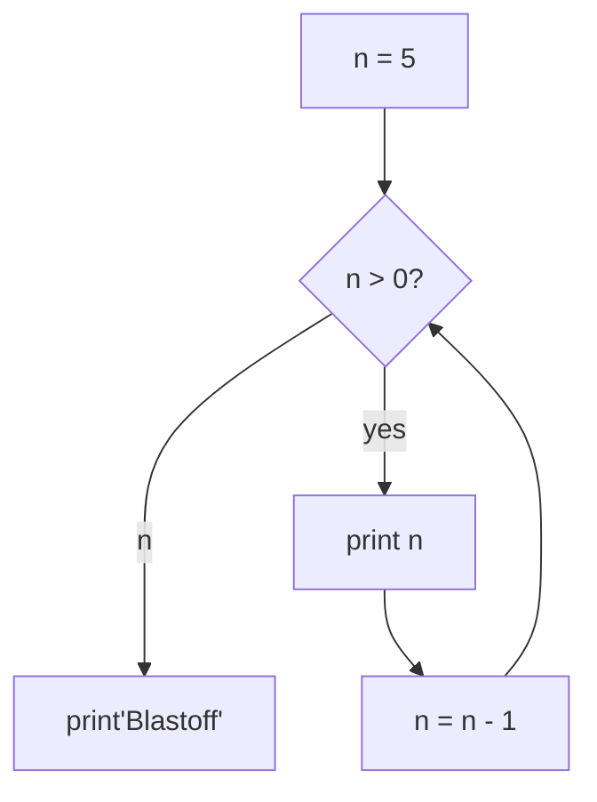

# PY4E - 모두를 위한 파이썬(1-2)

# Python for Everybody - Boostcourse

> 원하는 누구나 들을 수 있는 파이썬 강의
> 

%2072a3d3cbc70342648c15e53e56ce5009/2022.png)

오늘은 저번 게시물에 이어서 본격적인 문법에 대해 다뤄보려 한다.
1주차에는 앞선 게시물에 언급한 것과 같이 프로그래밍의 목적, 컴퓨터 구조를 배우고,
인터프리터를 서리하며 파이썬의 특징과 동작과정에 대해 배운다.

그 후에 실직적인 코딩인 문법에 들어간다.

예약어, 순차문, 조건문, 반복문 순서로 배운다.

예약어와 순차문은 크게 어려울 것이 없다고 생각한다. 예제로 HelloWorld 출력하기 이니…
다만 조건문과 반복문은 이 한 강의로 다 배우기에는 힘들다는 생각이다.

<aside>
❗ 이 글을 누가 볼지는 모르겠지만, 이 글을 보는 독자와 이 강의를 듣는 사람들의 대부분은 그저 흥미로 인해서가 아닌, 취업을 위해, 또는 이직을 위해, 업무에 실직적인 파이썬을 적용하기 위해 듣는다고 생각한다.  나도 마찬가지지만 이런 목적을 가진다면 이 강의는 맛보기라고 생각하고 따로 공부를 해야한다.

</aside>

## 1. 프로그래밍의 방식

파이썬을 실행하는 방법은 (상호)대화식(Interactive)와 스크립트 두가지 방식이 있다. 
대화식은 커맨드라인에 코드를 한줄 씩 입력 후 작동하여 한줄씩 실행이 되는 것이고,
스크립트 방식은 말 그대로 코드를 스트립트로 연속해서 작성한 후에 실행시키는 것이다.

 대화식은 아주 작은 코드들의 조각을 실행하는 것에는 유용하지만 후에 코드가 복잡해질수록 스크립트 방식을 사용하게 된다.
*대화식의 경우 코드가 길어져 실수할 경우 처음부터 다시 시작해야하기에 매우 불편하다.
  스크립트 방식은 파일에 명령을 작성하고 이를 보조 기억장치에 저장한 뒤 한번에 실행하기에 수정이 용이하다.

## 2. 예약어(Reserved Keyword)

 예약어란 프로그램에서 미리 정해둔, 쓰겠다고 ‘예약’해둔 용어들을 말한다.
이는 예약어를 통해 변수 이름 등과의 혼선을 막고 예약해둔 기능을 정상적으로 수행할 수 있도록 해준다. 예약어는 지정한 의미로만 쓰이는 단어이며, 지정한 의미외로는 사용이 불가하다.

 흔한 농담으로 조 이름을 정하는데 세번째 조의 조 이름을 ‘4조’라고 하고 네번째 조 이름을 ‘3조’라고 하면 교수님이 “3조 나와서 발표해!”라고 했을때 어느 조가 발표해야 하는지 혼선이 온다. 위와 같은 일을 막기위해 있는 것이 예약어이다. 

%2072a3d3cbc70342648c15e53e56ce5009/Untitled.png)

파이썬 예약어의 예시이자 주요 키워드 예시

위의 예시를 보면 알 수 있듯, 예약어로 설정된 단어는 ‘기능’을 가지고 있는 단어이다. 따라서 우리가 변수명, 함수명 등에 사용할 단어는 ‘기능’을 가지고 있지 않고 원하는 값을 뜻하거나 원하는 기능을 가질 고유의 이름을 사용하여야 한다.

<aside>
💡 변수명을 짓는 방법 등은 코치님의 피드백을 참고하여 후술하겠다.

</aside>

## 3. 순차문, 조건문, 반복문

 흔히 코딩테스트를 준비한다고 하면 알고리즘을 공부한다. 그리고 알고리즘은 위 3가지가 전부하고 해도 과언이 아니다. 알고리즘은 순차, 조건, 반복 3가지로 동작하고, 그 알고리즘을 실행하는 보다 세부적인 요소들로 함수, 리스트, 튜플, 딕셔너리 등등이 있는 것이다.

%2072a3d3cbc70342648c15e53e56ce5009/%25EC%2595%258C%25EA%25B3%25A0%25EB%25A6%25AC%25EC%25A6%2598_%25EC%2595%2584%25EC%259D%25B4%25EC%25BD%2598.png)

| 순차문 | 순서대로 진행하는 것 |
| --- | --- |
| 조건문 | 조건에 따라 어느 부분을 건너뛰는 것 |
| 반목문 | 같은 일을 반목해서 진행하는 것 |

이것들을 프로그래밍의 패턴이라고도 한다.

- 파이썬 프로그램은 문장으로 구성되어 있으며, 문단을 왼쪽에서 오른쪽으로 위에서 아래로 읽는 것 처럼 순서가 있다. 이 순서를 따라 진행하는 것을 순차문이라 한다.

```python
x = 2
## x = 2 수학식이 아님. x라고 이름 붙여진 박스 안에 2라는 값을 넣은 것
## 변수x에 상수 2를 넣은 것
## 여기서 x는 사용자가 지정한 변수 이름임. 이 변수 이름에는 예약어가 올 수 없음
x = x + 2
## 앞에서 변수 x에 2를 넣었고, 이번 줄에서 2가 들어가 있는 변수 x에 2을 더하는 것
print(x)
## 즉, x에는 4가 들어가있고, 결과값으로 4가 출력된다.
## 여기서 print는 예약어이자 함수이며, 괄호 안의 것을 출력하는 일을 한다.
```

- 조건문은 조건에 따라 실행하고 실행하지 않는 것이 정해지며 따라서 조건에 의해 어느 특정 부분을 건너뛰는 것을 말한다.

```python
x = 5
if x < 10: #어떤 것이 참일 경우만 실행 가능 / 변수 x에 5가 들어가 있으므로 참
  print('Smaller') # 'Smaller 출력
if x > 20: # 순차적으로 내려와서 x가 20보다 큰지 확인 / x에는 5가 들어가 있으므로 거짓
  print('Bigger') # 조건을 만족하지 않아 건너뛰어 실행되지 않음
print('Finis') # Finis가 출력됩니다.

출력 모습은 아래와 같음
>>> Smaller
>>> Finis
```

- 반복문은 반복문에 설정되어있는 조건에 따라 해당 조건에 만족하는한 같은 문장을 반복하여 실행하는 것을 말한다.

```python
n = 5
while n > 0:
#n이 0보다 크면 계속 실행. while 루프문임
#n의 값이 0이 되면 조건을 만족하지 않기에 아래 문장을 실행하지 않고 건너뛴다.
  print(n) # 5,4,3,2,1을 출력합니다.
  n = n - 1 # 1을 출력한 이후에 n-1로 n의 값을 0이 된다.
print('Blastoff!') # Blastoff를 출력합니다.
```

아래는 위의 반복문에 대한 데이터 흐름도, 즉 알고리즘이다.



<aside>
❗ 복잡한 문제를 해결하려 할 수록 위와 같은 알고리즘을 먼저 생각하여야 한다.

</aside>

```python
#데이터와 파일 이름을 읽고 파일을 열고 단어 히스토그램을 만들어
#제일 많이 있는 단어를 찾는 프로그램

name = input('Enter file:')
handle = open(name, 'r')
# 순차문 / 파일 이름을 물어보고 (사용자 입력을 받는다), 그 파일을 연다

counts = dict() #딕셔너리(자료구조의 한 종류)를 만든다

#여기부터 반목문 시작
for line in handle:
	words = line.split()
	for word in words: #반복문 안에 반목문
		counts[word] = counts.get(word, 0) + 1

bigcount = None
bigword = None
#순차문 실행

for word,count in counts.item():
	if bigcount is None or count > bigcount:
		bigword = word
		bigcount = count

print(bigword, bigcount)
```

가장 마지막 예시로 올라간 코드는 강의에서 예시로 나온것이나, 현재 단계에서 이해가 불가하다. 강의 후반부로 가면 이해할 수 있다.

## 4. 미션

  1주차 미션으로는 컴퓨터에 관해 생각하는 것과 파이썬으로 하고 싶은것 등 통상적인 OT수업내용과 같은 것들, 그리고 순차문, 반복문, 조건문을 사용한 간단한 문제를 푸는 것이 나왔다.
값을 입력하면 조건에 따라 값을 더하고 빼는 수준의 문제였다.

## 5. 마무리

 사실 코딩은 어렵게하면 정말 어렵게 할 수 있고, 쉽게하면 정말 쉽게할 수 있다.
코딩 관련 밈으로 초보자와 고급자가 별표(*)를 이용하여 크리스마스 트리를 출력할때
초보자는 사용자로부터 값을 받아오는 것 부터 시작해서 반복문 조건문 함수 등등 여러가지를 이용해서 구현하고, 고급자는 단순히 print만을 사용한다는 밈이 있다.

 만약 본인이 코딩을 처음 접한다면 1주차 라이브 강의에서 강연해주신 현업자께서 말씀하신 것 처럼 오류제어, 출력값 제한 등을 신경쓰지 말고 그저 배운 것을 한번 사용해 본다는 느낌으로 접근하기를 권한다.

<aside>
💡 저작권에 따라서 전부 공개할 수는 없으나, 본인이, 본인이 속한 팀에서 작성한 문제는 개인 블로그 등에 공개가 가능하다고 답변받았다.
미션의 자세한 내용과 주석 등은 별도 페이지를 통해 깃헙에 업로드할 예정이다.

</aside>

##