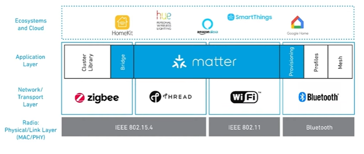
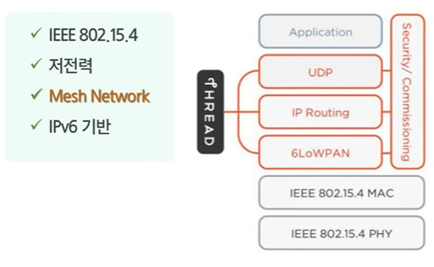

# 2023_07_28 TIL
---

# Matter

스마트 홈 IoT 서비스 이용 과정

보안을 이유로 서로 각자가 지원하는 디바이스와 앱 이외에는 서로 연동되지 않음

이걸 통일하는게 편하다는 니즈로 연구사 시작되었다.

지그비 얼라이언스에 의해 프로젝트 chip시작
21년 지그비 얼라이언스는 csa로 프로젝트 chip은 matter로 명칭을 변경했다.

메터란 여러 플랫폼에서 공통으로 활용할 수 있는 통합 프로토콜

특징
- IPv6 기반 홈 IoT 통신 표준
    - 이더넷, 와이파이, 스레드 등 지원
- 멀티 어드민
- 메쉬 네트워크

장점
1. 단순성
    - 구매 및 사용이 간편
2. 상호 운용성
    - 여러 브랜드 장치가 함께 작동
3. 신뢰성
    - 일관되고 반응이 빠른 로컬 연결
4. 보안
    - 강력하지만 간소화

    

    

    메터의 구성 찾아볼 것

    메터에 대한 전망
- 2023년부터 30년 사이 55억개의 메터 지원 스마트홈 제품 출시 전망
향후 5년 내에 스마트홈 디바이스 제조사의 절반 이상 메터 지원 예정

최신 메터 동향
- Spec 1.0이 2022년 10월 발표 10여종의 디바이스 유형 지원
- 삼성전자의 SmartThings Hub가 최초로 메터 인증 획득

최신 메터 지원 기기
- 삼성전자 스마트싱스 스테이션이 2023년 ces에서 공개
- 140억개의 커넥티드 기기들을 연결하기 위한 기술 비전
- 23년 10월 CSA가 메터 1.2버전 발표 예정
- 소형 IoT 기기 뿐만 아니라 다양한 가전까지 적용 대상에 포함될 가능성이 높음

​UDP를 쓰는 이유는 저전력을 위해 사용합니다 TCP는 핸드쉐이크 과정이 복잡해서 전력을 더 많이 사용합니다. 신뢰성 더 상위 레이어에서 보통 구현합니다.

애플의 에어드롭은 블루투스로 주변기기를 탐색 후 와이파이로 빠르게 일시적으로 대용량의 데이터를 전송하기 위한 자체규격입니다.

---

로그인 회원가입 비밀번호 찾기는 이제 끝

엑세스 토큰 리프레시 토큰 시작

온보딩 프로세스 마무리

메인 기능 시작

정민 - 
스터디 생성 팝업 진행중
수락 거절 페이지 만들어야함

상세페이지 차주 끝

석다영
유저 대시보드 차주 끝

디자인 지속수정

지민성, 김민식 - 소셜 로그인

지민성 
- 컴파일 기능 구현
- 터미널 부분 사용자 구현
- 차주 웹IDE페이지 완성
- 음성제어 자료조사

---

0728 중간발표 회고

싸피 중간 발표가 끝났다.
회고록을 작성해보려고 한다.

발표 회고라기보다 프로젝트 중간점검 회고라고 생각하는게 좋을 것 같다.