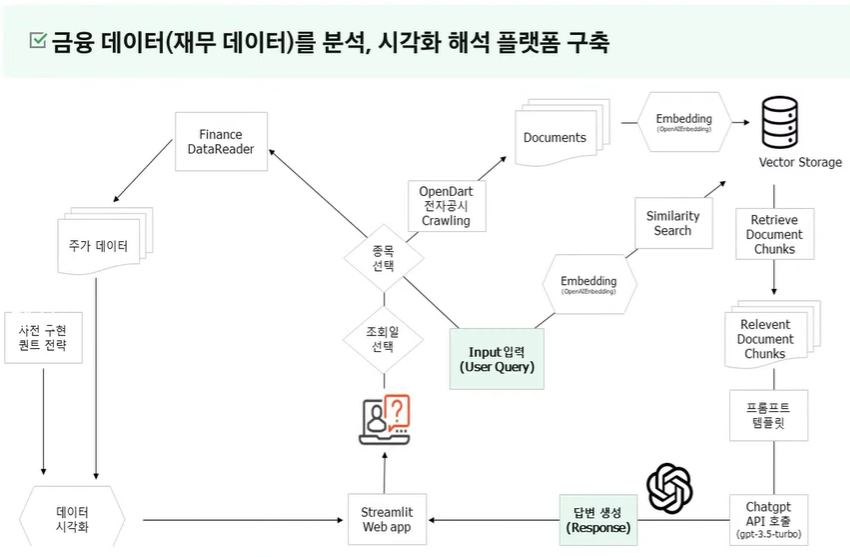
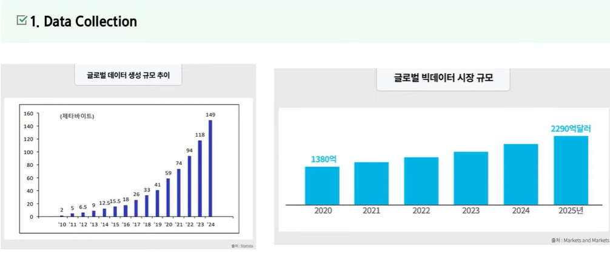
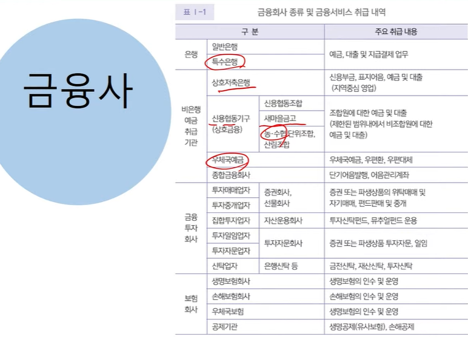
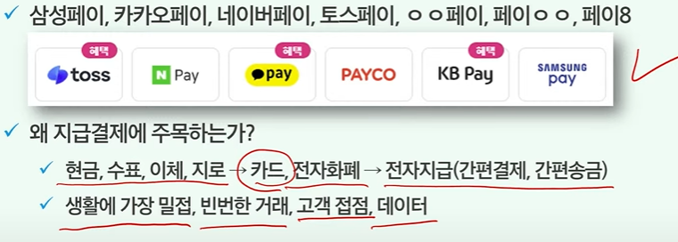
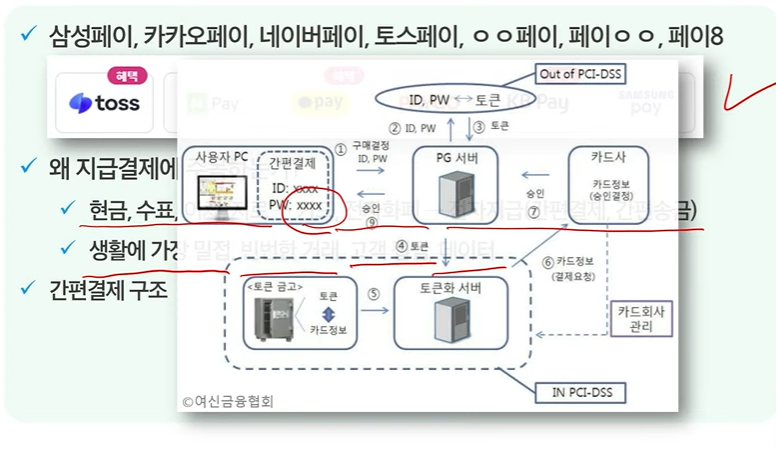
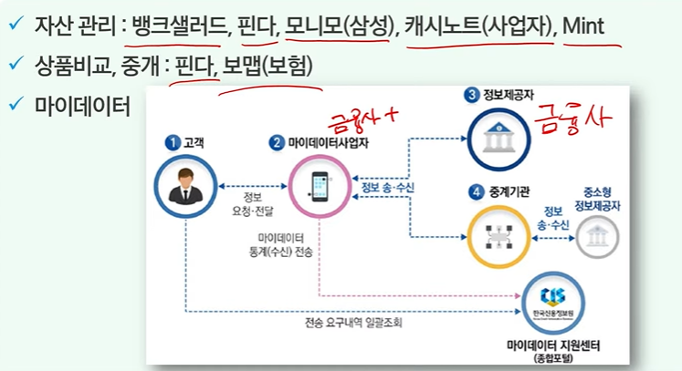
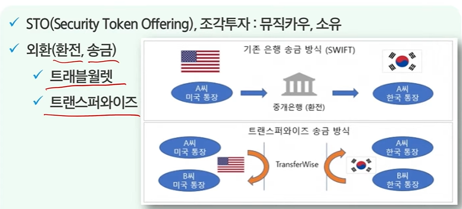

기술이 발전하면서 인공지능 데이터처리 IOT등의 중요성이 커지고 있다.

질문
실제 데이터나 API를 받아올 수 없어서
금융결제원 오픈 API 개발자센터에 공개된 명세서를 기반으로
일종의 오픈 API를 저희가 만들어서 사용하려합니다.
이렇게 했을때 저희가 면접이나 포폴에 넣었을때 효과가 있을까요?

LLM?
큰 규모의 언어 모델을 가리키는 용어로 인간의 언어를 이해하고 생성하도록 훈련된 일종의 인공지능 모델
ex) ChatGPT 4.0, PaLM 2, LLaMA Meta

Vector DataBase?
AI에서는 자주 사용되는 데이터양이 많고 구조화가 되어있지 않아서 관계형 데이터베이스를 사용하는 것에 어려움을 겪음
그래서 벡터 데이터베이스가 나옴

예를 들어서 픽셀 값을 벡터 값으로 변환하는 등

elasticsearch도 Vector DataBase이다.

금융데이터 활용 및 시각화

마이데이터가 중요함
이런 중요한데이터를 수집하는 방법에는 여러가지 악 있음
웹 크롤링, API, 라이브러리
yahoo! finace 한번 찾아볼 것

### 인생과 금융

금융사, 핀테크, 빅테크의 차이?
2018년 스타트업 얼라이언스에서 잘나가는 핀테크 스타트업 목록 발표

시큐리티 토큰 오퍼링, 조각투자: 뮤직카우, 소유

자기네 안에서 필요한 서비스를 매칭해준다.

토스 뱅크의 코어뱅킹 구조

계좌이체가 이루어지는 방식

---

UX 코치 세션

혼란스럽고 여러 의미를 가진 아이콘 지양
과거의 아이콘 지양
독특한 아이콘 지양
레이블과 사용성

직관적인 아이콘에 레이블을 붙이면 사용자의 80펴센트 이상이 예측하고 레이블이 없으면 60% 레이블이 없고 독특한 아이콘이면 40% 이하의 인식

UX라이팅이란?
사용자가 서비스 안에서 글을 쓰는 것
의미 없는 단어 제거하기
사용자가 원하는 정보를 빠르게 습득할 수 있도록 간결하게 작성할 것
의미없는 문장 제거하기
반드시 필요한 내용만 전달하기
우리만 아는 내용은 바꾸기(드립치지 않기)

사용성
정보를 모두 입력하고 나서 다음 단계로 넘어가게 하기
포커스 상태로 진입하게 하기
사용자가 이전에 입력한 정보라면, 미리 채워주기
모바일의 경우, 사용할 키보드 미리 세팅하기

사용자 심리
사용자 온보딩 - 빈 상태 고려하기
로딩 바 / 스켈레톤 UI 사용하기

구글이 웹의 성능 지표를 결정짓는 3가지 지표
LCP
- Google PageSpeed Insights
이 주소에 url을 넣으면 알아서 진단해준다.

FID
- 반응속도를 의미한다.
개발자 도구 > Perfomance > 녹화
그래프가 있는 부분ㅇ으로 스크린샷 범주 조절
그래프의 색은 브라우저 랜더링의 표시
스크린샷 범주를 조절하고 드래그를 해보면 내용과 요약이 나온다.
작업이 총 얼마가 걸리고 어떤 정보가 있는지 알 수 있다.
이 외에도 라이트 하우스라던지 다양한 툴이 있다.

백엔드 성능 측정
- 부하테스트
- jmeter

Jmeter
- 클라이언트 - 서버 구도로 된 소프트웨어의 성능 테스트를 위해 만들어진 자바 프로그램
실제 응답 시간과 차이가 날 수 있음
간단한 설정, 단계별로 상승 시키면서 테스트 가능

유저 트래킹
- Google Analytics, Heatmap...
- 프론트엔드에 코드 하나로 추가 가능하다.

nGrinder
