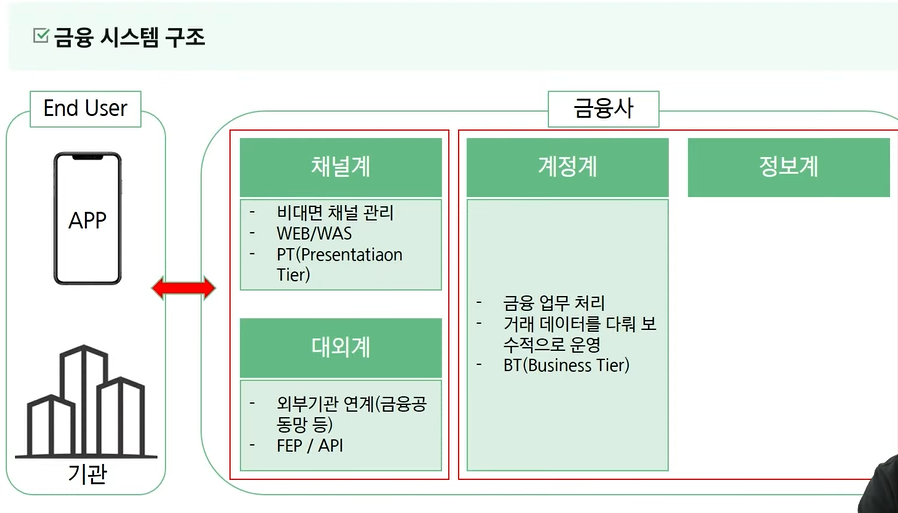
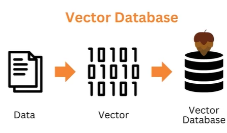
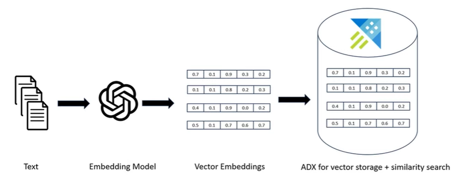
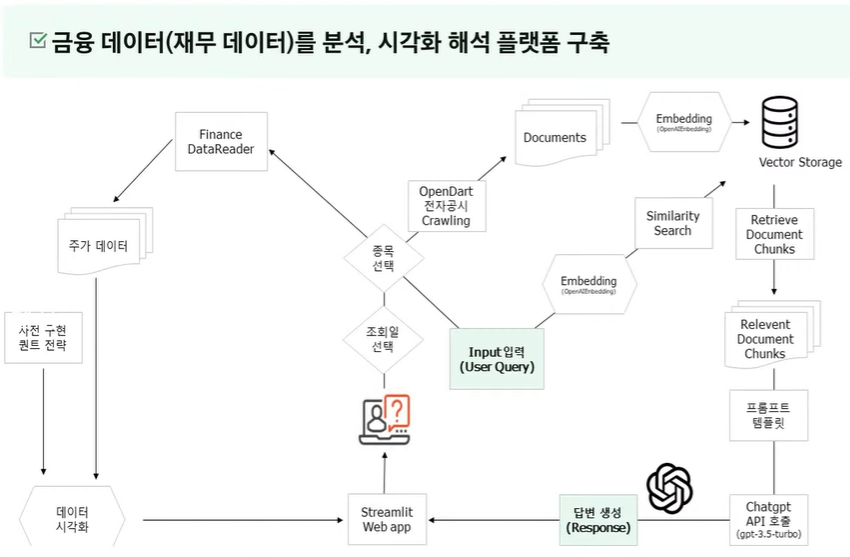
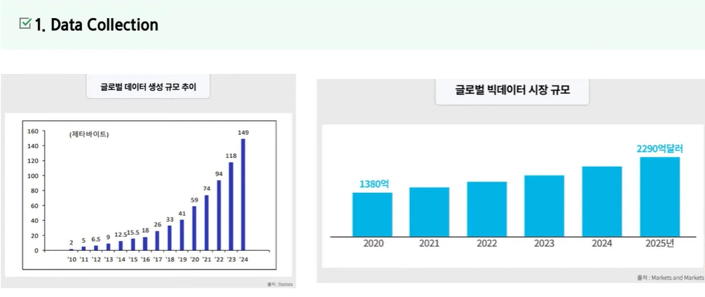
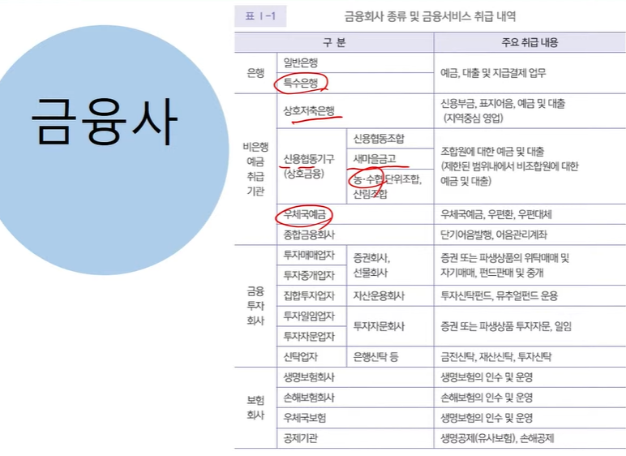
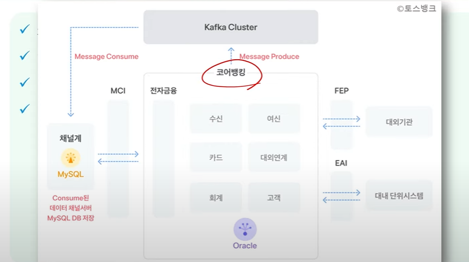

### 오늘날 기술이 발전하면서 인공지능 데이터처리 IOT등의 중요성이 커지고 있다.

---
# LLM이란?
- 큰 규모의 언어 모델을 가리키는 용어로 인간의 언어를 이해하고 생성하도록 훈련된 일종의 인공지능 모델을 말한다.
- ex) ChatGPT 4.0, PaLM 2, LLaMA Meta

# Vector DataBase란?
- AI에서는 자주 사용되는 데이터베이스이다.
- AI분야는 데이터의 양이 방대하고 구조화 되어있지 않은 경우가 많기에 관게형 데이터베이스를 사용하는 것이 어렵다.
- 이에 Vector DataBase가 생겼다.

- 아래는 픽셀 값을 벡터 값으로 변환하는 예시이다.

- elasticsearch도 Vector DataBase의 한가지이다.

### 금융데이터 활용 및 시각화

### 빅데이터 성장

### 데이터 수집 방법
- 웹 크롤링, API, 라이브러리ㅓ
- yahoo finance 찾아볼 것
---

### 금융회사 종류 및 금융서비스 취급 내역 

금융사, 핀테크, 빅테크의 차이?
2018년 스타트업 얼라이언스에서 잘나가는 핀테크 스타트업 목록 발표

토스 뱅크의 코어뱅킹 구조